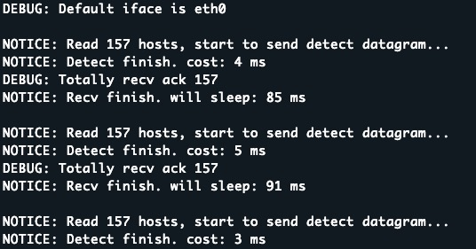
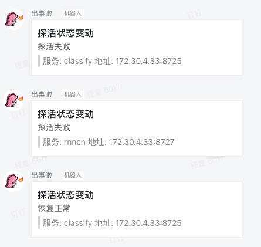

## Nurse
Nurse is a health check/port detect tool for small or medium server cluster using tcp syn-scan, for those unhealthy ports, it can send Alert message via DingDing Robot Api.

**NOTICE:** Because nurse using raw socket to send & capture packet, it requires **root** account to run. For raw_socket, you can refer [this](http://man7.org/linux/man-pages/man7/raw.7.html)  

## Require
linux environment, GCC version > 4.8

## Install
Just type `make`, if no error, nurse will be generated in the same directory.

## Usage
Type `./nurse -h` you can see the help info
```
Usage: ./nurse -[frh]
	-f	file contains detect target with format:[ip:port\tserv_name], ie.: 192.168.0.1:80	test
	-r	dingding robot url
	-h	print this help message
For any questions pls feel free to contact frostmourn716@gmail.com
```

To get DingDing Robot url you can refer [this](https://open-doc.dingtalk.com/docs/doc.htm?spm=a219a.7629140.0.0.karFPe&treeId=257&articleId=105735&docType=1). After adding a robot you can get an url, using `https://oapi.dingtalk.com/robot/send?access_token=123` as an example. 

Detecting targets are organized in a text file, for example, `detect_host.txt`:
```
172.30.4.33:8725  classify
172.30.4.33:8727  rnncn
```

To run nurse, using `./nurse -f ./detect_host.txt -r https://oapi.dingtalk.com/robot/send?access_token=123 > log.txt 2>&1 &`

If every thing is ok, it will log like this:



If some ports are unstable, nurse will send alert message like this:



## Future
Now Nurse is just a simple health monitor tool on single server with little configuration for near thousand targets, if needed, it can be extended for larger cluster and support more alert methods. 
